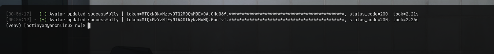

# Discord Avatar Changer

A small Python script that changes a Discord profile picture using an image from `Input/pfps/`.

It uses curl_cffi for HTTP requests and automatically spoofs browser-related headers to mimic a Chrome client.

## Preview




## What it does

* **Random PFP:** Picks a random `.png`, `.jpg`, `.jpeg`, or `.webp` from `Input/pfps/`.
* **Base64 encoding:** Converts the selected image into a format Discord accepts.
* **Browser headers:** Builds `sec-ch-ua`, `x-super-properties` and other headers from the User-Agent in config.json.
* **Token support:** Reads Discord tokens from `Input/token.txt`.
* **Per-token timing:** Shows how long each account update takes.
* **Simple output:** Reports successful updates and failed requests with their status codes.

The script runs through the tokens once and exits.

## Setup

### 1. Install the requirement

```bash
pip install curl_cffi
```

### 2. Project structure

```text
pfp_changer/
├── Input/
│   ├── config.json
│   ├── token.txt
│   └── pfps/
│       └── image.png
│
└── src/
    ├── main.py
    └── modules/
        ├── header.py
        ├── avatar.py
        └── log.py
```

### 3. Configure your User-Agent

`Input/config.json`:

```json
{
  "useragent": "your useragent"
}
```

The Chrome version is extracted from the User-Agent and used when generating the browser-related headers. Make sure the impersonate value matches the Chrome version in your User-Agent.

### 4. Add your token

`Input/token.txt` supports either a plain token:

```text
your token
```

or a colon-separated format where the token is the third field:

```text
something:something:YOUR_TOKEN
```

**Never share `token.txt`**

### 5. Add your PFPs

Put your images inside:

```text
Input/pfps/
```

Supported formats:

```text
.png
.jpg
.jpeg
.webp
```

## Running

From the project directory:

```bash
python src/main.py
```

A successful update looks like:

```text
Avatar updated successfully | token=YOUR_VISIBLE_PART*********************************************, status_code=200, took=2.26s
```

The token is partially hidden in the console output.

## Response codes

| Code  | Meaning                     |
| ----- | --------------------------- |
| `200` | Avatar updated successfully |
| `400` | Bad request                 |
| Other | Request failed              |

The response body is printed for unsuccessful requests to help with debugging.

## Notes

* The execution time shown is measured **individually for each token**.
* The script generates a new set of browser-related values when creating each client.
* Keep your `token.txt` and `config.json` private.
* Don't paste your token when reporting an issue.

## Rules

* Don't copy the project, rename it, and claim you made it.
* Don't sell or paywall the project.
* Use it only with accounts you own or are authorized to manage.
* If you use parts of the code, give credit and link back to this repository.

## Disclaimer

This project is provided for educational purposes. Use it at your own risk. The author isn't responsible for account restrictions, loss of access, or other consequences resulting from its use.

## ☕ Donations

This project is free. If it saved you some time and you want to support it, LTC is appreciated:

```text
LXdgPhE4UfVUgtfXkT7wR1T4Jxam9sCsbb
```
